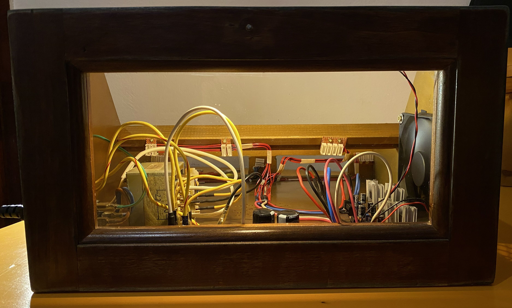
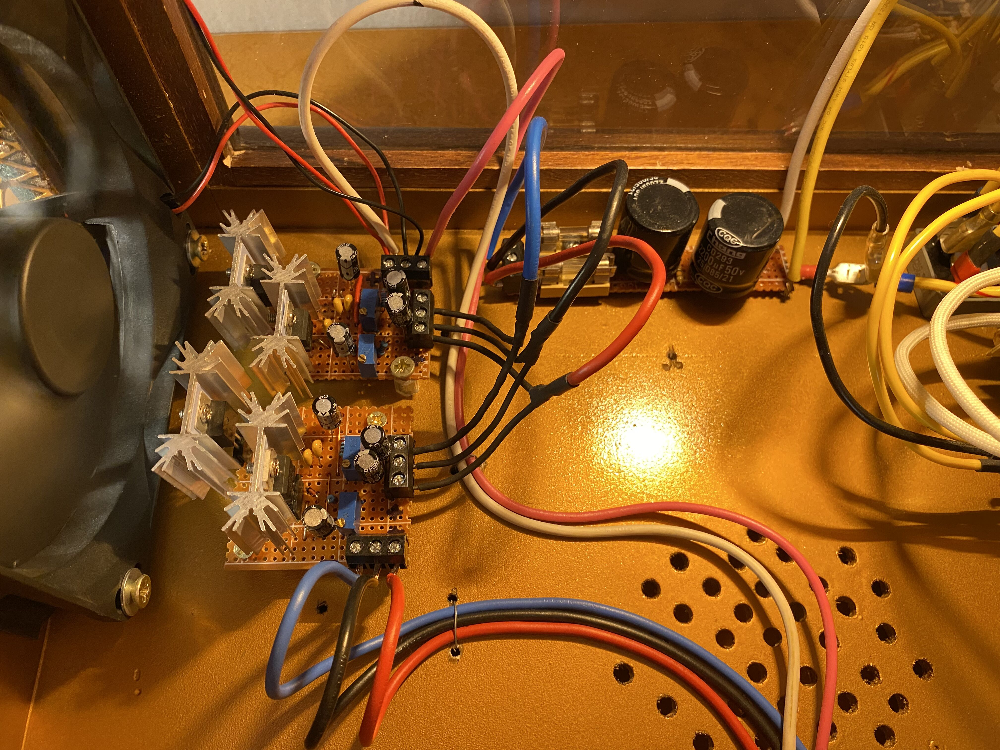

# DIY Linear PSU for Modular Synth

This repository documents the design and construction of a linear quad-rail power supply for a DIY modular synthesizer system.

The PSU provides stable **±15V, ±12V rails** starting from a center-tapped transformer and uses classic linear regulators to ensure low noise and reliability for analog audio modules.

The project was built as part of a larger DIY modular synth system.

---

⚠️ **Important note:** the core schematic used for this PSU **is not my original design**.
It is based on the excellent work of **Eddy Bergman**, whose website is an outstanding resource for DIY modular synthesizer builders.

The original design and many other extremely well documented modules can be found here:

https://www.eddybergman.com/

If you are interested in building your own modular synth, his site is one of the best starting points available.

This repository documents **my implementation of the PSU**, including the specific components used, construction details, and integration into my own modular synth system. Just for my own archive and as a resource for anyone who wants to use it!

---

# Overview

The PSU follows a classic linear power supply architecture:

Transformer
→ Bridge Rectifier
→ Smoothing Capacitors
→ Linear Regulators
→ Power Distribution Bus

*Inside of the hollow Synth case seen from the glass window. All modules removed: PSU, power bus and fan visible.*

---

# Hardware

- Transformer: Samsung MAX-445
  - Primary: 110 / 220 V AC
  - Secondary: 17-0-17 V / 26 V / 16 V
  - Rated power: **120–130 VA**

- Bridge Rectifier: KBPC3510
  - Maximum current: **35 A**
  - Maximum reverse voltage: **1000 V**

- Linear Regulators: LM317 and LM337
  - LM317 for +12V, +15V rails
  - LM337 for -12V, -15V rails

The **17-0-17 V center-tapped winding** is used as a starting point to generate the rails.

NOTE: Thanks to the relatively high power rating, the PSU is designed to **power the current rack and a future second rack mounted above it.**

The output voltage of the winding goes then to the bridge rectifier, which feeds two large smoothing capacitors, one for the positive rail and one for the negative rail. Each voltage line is then interrupted by a fuse (2.5 A, slow-blow type) that helps the PSU (in particular the subsequent regulator stages) limit the maximum current provided. This is necessary since the linear regulators have a rated output current of 1.5 A each. After the fuses, the two voltage lines and the ground line are split to feed two identical regulator boards, where the output voltages are set using trim potentiometers.

---

# Power Distribution

Power is distributed to the modules using several **stripboard bus boards**, each connected to the main stripboards with thick multistranded copper wires of different colours, following a tree structure. Each bus board powers a small group of modules.

Typical module current consumption is assumed to be maximum: ~100 mA per module.

---

# Safety Notes

⚠️ **This project involves mains voltage.**

Only build or modify this PSU if you are familiar with safe electrical practices.

Important precautions include:

* Proper earth grounding of any exposed metal parts
* Fuse on the transformer primary
* Proper insulation of mains wiring
* Strain relief on the power cable
* Secure mounting of the transformer

### Thermal Management

The linear regulators dissipate a significant amount of heat and require **adequate heatsinking**.

Important considerations:

* Use **large heatsinks** for every regulator.
* Ensure that the heatsinks **never touch each other**, since the regulators reference different rails and electrical contact could cause a short.
* Maintain sufficient airflow around the regulators.
* Remember to tin all the copper strips that carry current (under the boards).

To improve thermal performance, the PSU includes a **cooling fan placed in front of the regulators**, which pushes warm air out of the case.

*Regulator boards: the front one for ±15V, the rear one for ±12V.*

---

# Build Philosophy

The design prioritizes simplicity: straightforward circuits, common components, easy repair, and generous power margins. Linear regulation was the obvious choice for an analog system — switching supplies are cheap and compact, but the **noise** they inject into audio rails isn't worth the trade-off.

Where possible, salvaged materials and second-hand components were used. The first rack was built from an old wardrobe drawer — which turned out to be a surprisingly good enclosure as you can see from the pictures!

---

# Additional Features

To improve usability and maintenance of the system, the PSU enclosure also includes **internal lighting**, used both to illuminate the inside of the case for debugging and maintenance and to enhance the visual appearance of the system, since the back of the enclosure is made of glass (ex-front of the drawer).

---

# Status

✔ Fully functional  
✔ Currently powering the first modules of the synth system  
🔧 Designed with enough headroom to support a **second rack in the future**  

---

# License

This project is based on the original design by **Eddy Bergman** (https://www.eddybergman.com/). All credit for the original concept and schematic goes to him.

My contribution is limited to rebuilding and adapting the design for my own system. Please refer to the original project for the source license terms.
